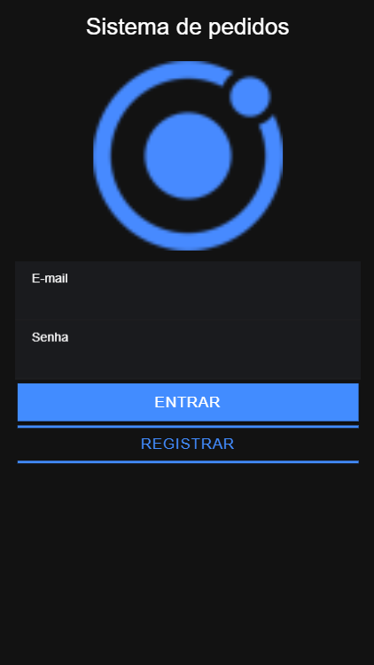

<h1 align="center">
    Sistema de Pedido
</h1>

_________

## ♻️ Sobre o projeto:

<p>Criado um Sistema de Pedidos com Ionic - Curso Spring Boot, Hibernate, REST, Ionic, JWT, S3, MySQL, MongoDB - Udemy</p>
<p>Projeto full stack completo! Java Spring Boot 2 no back-end e Ionic no front-end. Do design UML ao Heroku e Play Store!</p>

## 🚀 Quick start

1.  **Clone o projeto.**

    ```shell
    git clone https://github.com/gabrieljony/springboot-ionic-client.git
    ```

2.  **Project setup.**

    Instale as dependencias da aplicação.

    ```shell
    cd springboot-ionic-client/
    npm install
    ```
    
3.  **Compiles.**

    ```shell
    npm start
    ```
    
    Seu site está sendo executado agora em `http://localhost:4200`
    
## 💻 Template



## 💫 Links úteis

## 📝 License

Esse projeto está sob a licença MIT. Veja o arquivo [LICENSE](LICENSE.md) para mais detalhes.

---

<h4 align="center">
    Desenvolvido por <a href="https://www.linkedin.com/in/gabriel-jony/">Gabriel Jony</a>
</h4>


  

